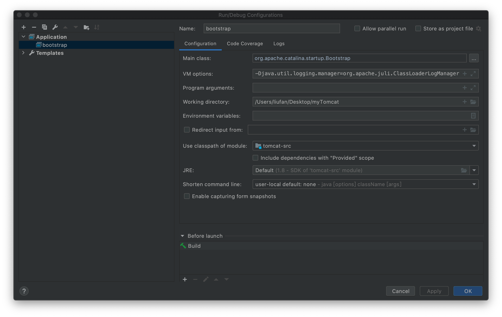

# myTomcat

```
mvn clean compile
```


tomcat源码debug搭建

本地搭建时，jvm参数配置:
```
-Djava.util.logging.config.file=/Users/liufan/Desktop/myTomcat/catalina-home/conf/logging.properties -Dcatalina.home=/Users/liufan/Desktop/myTomcat/catalina-home/ -Dcatalina.base=/Users/liufan/Desktop/myTomcat/catalina-home/ -Djava.endorsed.dirs=/Users/liufan/Desktop/myTomcat/catalina-home/endorsed -Djava.io.tmpdir=/Users/liufan/Desktop/myTomcat/catalina-home/temp -Djava.util.logging.manager=org.apache.juli.ClassLoaderLogManager
```

要配置成一行，此处为了好看，分行写:
```java
-Djava.util.logging.config.file=/Users/liufan/Desktop/myTomcat/catalina-home/conf/logging.properties
-Dcatalina.home=/Users/liufan/Desktop/myTomcat/catalina-home/
-Dcatalina.base=/Users/liufan/Desktop/myTomcat/catalina-home/
-Djava.endorsed.dirs=/Users/liufan/Desktop/myTomcat/catalina-home/endorsed
-Djava.io.tmpdir=/Users/liufan/Desktop/myTomcat/catalina-home/temp
-Djava.util.logging.manager=org.apache.juli.ClassLoaderLogManager
```

参考博客

[https://my.oschina.net/u/3737136/blog/2992813](https://my.oschina.net/u/3737136/blog/2992813)

[https://juejin.im/post/5b2b5e90e51d4558cc35b89b](https://juejin.im/post/5b2b5e90e51d4558cc35b89b)


## run sucess



```
/Library/Java/JavaVirtualMachines/jdk1.8.0_161.jdk/Contents/Home/bin/java -Djava.util.logging.config.file=/Users/liufan/Desktop/myTomcat/catalina-home/conf/logging.properties -Dcatalina.home=/Users/liufan/Desktop/myTomcat/catalina-home/ -Dcatalina.base=/Users/liufan/Desktop/myTomcat/catalina-home/ -Djava.endorsed.dirs=/Users/liufan/Desktop/myTomcat/catalina-home/endorsed -Djava.io.tmpdir=/Users/liufan/Desktop/myTomcat/catalina-home/temp -Djava.util.logging.manager=org.apache.juli.ClassLoaderLogManager -javaagent:/Applications/IntelliJ IDEA.app/Contents/lib/idea_rt.jar=62519:/Applications/IntelliJ IDEA.app/Contents/bin -Dfile.encoding=UTF-8 -classpath /Library/Java/JavaVirtualMachines/jdk1.8.0_161.jdk/Contents/Home/jre/lib/charsets.jar:/Library/Java/JavaVirtualMachines/jdk1.8.0_161.jdk/Contents/Home/jre/lib/deploy.jar:/Library/Java/JavaVirtualMachines/jdk1.8.0_161.jdk/Contents/Home/jre/lib/ext/cldrdata.jar:/Library/Java/JavaVirtualMachines/jdk1.8.0_161.jdk/Contents/Home/jre/lib/ext/dnsns.jar:/Library/Java/JavaVirtualMachines/jdk1.8.0_161.jdk/Contents/Home/jre/lib/ext/jaccess.jar:/Library/Java/JavaVirtualMachines/jdk1.8.0_161.jdk/Contents/Home/jre/lib/ext/jfxrt.jar:/Library/Java/JavaVirtualMachines/jdk1.8.0_161.jdk/Contents/Home/jre/lib/ext/localedata.jar:/Library/Java/JavaVirtualMachines/jdk1.8.0_161.jdk/Contents/Home/jre/lib/ext/nashorn.jar:/Library/Java/JavaVirtualMachines/jdk1.8.0_161.jdk/Contents/Home/jre/lib/ext/sunec.jar:/Library/Java/JavaVirtualMachines/jdk1.8.0_161.jdk/Contents/Home/jre/lib/ext/sunjce_provider.jar:/Library/Java/JavaVirtualMachines/jdk1.8.0_161.jdk/Contents/Home/jre/lib/ext/sunpkcs11.jar:/Library/Java/JavaVirtualMachines/jdk1.8.0_161.jdk/Contents/Home/jre/lib/ext/zipfs.jar:/Library/Java/JavaVirtualMachines/jdk1.8.0_161.jdk/Contents/Home/jre/lib/javaws.jar:/Library/Java/JavaVirtualMachines/jdk1.8.0_161.jdk/Contents/Home/jre/lib/jce.jar:/Library/Java/JavaVirtualMachines/jdk1.8.0_161.jdk/Contents/Home/jre/lib/jfr.jar:/Library/Java/JavaVirtualMachines/jdk1.8.0_161.jdk/Contents/Home/jre/lib/jfxswt.jar:/Library/Java/JavaVirtualMachines/jdk1.8.0_161.jdk/Contents/Home/jre/lib/jsse.jar:/Library/Java/JavaVirtualMachines/jdk1.8.0_161.jdk/Contents/Home/jre/lib/management-agent.jar:/Library/Java/JavaVirtualMachines/jdk1.8.0_161.jdk/Contents/Home/jre/lib/plugin.jar:/Library/Java/JavaVirtualMachines/jdk1.8.0_161.jdk/Contents/Home/jre/lib/resources.jar:/Library/Java/JavaVirtualMachines/jdk1.8.0_161.jdk/Contents/Home/jre/lib/rt.jar:/Library/Java/JavaVirtualMachines/jdk1.8.0_161.jdk/Contents/Home/lib/ant-javafx.jar:/Library/Java/JavaVirtualMachines/jdk1.8.0_161.jdk/Contents/Home/lib/dt.jar:/Library/Java/JavaVirtualMachines/jdk1.8.0_161.jdk/Contents/Home/lib/javafx-mx.jar:/Library/Java/JavaVirtualMachines/jdk1.8.0_161.jdk/Contents/Home/lib/jconsole.jar:/Library/Java/JavaVirtualMachines/jdk1.8.0_161.jdk/Contents/Home/lib/packager.jar:/Library/Java/JavaVirtualMachines/jdk1.8.0_161.jdk/Contents/Home/lib/sa-jdi.jar:/Library/Java/JavaVirtualMachines/jdk1.8.0_161.jdk/Contents/Home/lib/tools.jar:/Users/liufan/Desktop/myTomcat/tomcat-src/target/classes:/Users/liufan/.m2/repository/org/easymock/easymock/3.4/easymock-3.4.jar:/Users/liufan/.m2/repository/org/apache/ant/ant/1.7.0/ant-1.7.0.jar:/Users/liufan/.m2/repository/org/apache/ant/ant-launcher/1.7.0/ant-launcher-1.7.0.jar:/Users/liufan/.m2/repository/wsdl4j/wsdl4j/1.6.2/wsdl4j-1.6.2.jar:/Users/liufan/.m2/repository/javax/xml/jaxrpc-api/1.1/jaxrpc-api-1.1.jar:/Users/liufan/.m2/repository/org/eclipse/jdt/core/compiler/ecj/4.5.1/ecj-4.5.1.jar:/Users/liufan/.m2/repository/javax/xml/soap/javax.xml.soap-api/1.4.0/javax.xml.soap-api-1.4.0.jar org.apache.catalina.startup.Bootstrap
09-Feb-2021 21:01:05.900 警告 [main] org.apache.catalina.startup.ClassLoaderFactory.validateFile Problem with directory [/Users/liufan/Desktop/myTomcat/catalina-home/lib], exists: [false], isDirectory: [false], canRead: [false]
09-Feb-2021 21:01:05.903 警告 [main] org.apache.catalina.startup.ClassLoaderFactory.validateFile Problem with directory [/Users/liufan/Desktop/myTomcat/catalina-home/lib], exists: [false], isDirectory: [false], canRead: [false]
09-Feb-2021 21:01:05.903 警告 [main] org.apache.catalina.startup.ClassLoaderFactory.validateFile Problem with directory [/Users/liufan/Desktop/myTomcat/catalina-home/lib], exists: [false], isDirectory: [false], canRead: [false]
09-Feb-2021 21:01:05.903 警告 [main] org.apache.catalina.startup.ClassLoaderFactory.validateFile Problem with directory [/Users/liufan/Desktop/myTomcat/catalina-home/lib], exists: [false], isDirectory: [false], canRead: [false]
09-Feb-2021 21:01:05.913 严重 [main] org.apache.catalina.startup.Catalina.initDirs Cannot find specified temporary folder at [/Users/liufan/Desktop/myTomcat/catalina-home/temp]
09-Feb-2021 21:01:06.219 信息 [main] org.apache.catalina.startup.VersionLoggerListener.log Server version:        Apache Tomcat/@VERSION@
09-Feb-2021 21:01:06.219 信息 [main] org.apache.catalina.startup.VersionLoggerListener.log Server built:          @VERSION_BUILT@
09-Feb-2021 21:01:06.219 信息 [main] org.apache.catalina.startup.VersionLoggerListener.log Server number:         @VERSION_NUMBER@
09-Feb-2021 21:01:06.219 信息 [main] org.apache.catalina.startup.VersionLoggerListener.log OS Name:               Mac OS X
09-Feb-2021 21:01:06.219 信息 [main] org.apache.catalina.startup.VersionLoggerListener.log OS Version:            10.15.7
09-Feb-2021 21:01:06.220 信息 [main] org.apache.catalina.startup.VersionLoggerListener.log Architecture:          x86_64
09-Feb-2021 21:01:06.220 信息 [main] org.apache.catalina.startup.VersionLoggerListener.log Java Home:             /Library/Java/JavaVirtualMachines/jdk1.8.0_161.jdk/Contents/Home/jre
09-Feb-2021 21:01:06.220 信息 [main] org.apache.catalina.startup.VersionLoggerListener.log JVM Version:           1.8.0_161-b12
09-Feb-2021 21:01:06.220 信息 [main] org.apache.catalina.startup.VersionLoggerListener.log JVM Vendor:            Oracle Corporation
09-Feb-2021 21:01:06.220 信息 [main] org.apache.catalina.startup.VersionLoggerListener.log CATALINA_BASE:         /Users/liufan/Desktop/myTomcat/catalina-home
09-Feb-2021 21:01:06.220 信息 [main] org.apache.catalina.startup.VersionLoggerListener.log CATALINA_HOME:         /Users/liufan/Desktop/myTomcat/catalina-home
09-Feb-2021 21:01:06.221 信息 [main] org.apache.catalina.startup.VersionLoggerListener.log Command line argument: -Djava.util.logging.config.file=/Users/liufan/Desktop/myTomcat/catalina-home/conf/logging.properties
09-Feb-2021 21:01:06.221 信息 [main] org.apache.catalina.startup.VersionLoggerListener.log Command line argument: -Dcatalina.home=/Users/liufan/Desktop/myTomcat/catalina-home/
09-Feb-2021 21:01:06.221 信息 [main] org.apache.catalina.startup.VersionLoggerListener.log Command line argument: -Dcatalina.base=/Users/liufan/Desktop/myTomcat/catalina-home/
09-Feb-2021 21:01:06.221 信息 [main] org.apache.catalina.startup.VersionLoggerListener.log Command line argument: -Djava.endorsed.dirs=/Users/liufan/Desktop/myTomcat/catalina-home/endorsed
09-Feb-2021 21:01:06.221 信息 [main] org.apache.catalina.startup.VersionLoggerListener.log Command line argument: -Djava.io.tmpdir=/Users/liufan/Desktop/myTomcat/catalina-home/temp
09-Feb-2021 21:01:06.222 信息 [main] org.apache.catalina.startup.VersionLoggerListener.log Command line argument: -Djava.util.logging.manager=org.apache.juli.ClassLoaderLogManager
09-Feb-2021 21:01:06.222 信息 [main] org.apache.catalina.startup.VersionLoggerListener.log Command line argument: -javaagent:/Applications/IntelliJ IDEA.app/Contents/lib/idea_rt.jar=62519:/Applications/IntelliJ IDEA.app/Contents/bin
09-Feb-2021 21:01:06.222 信息 [main] org.apache.catalina.startup.VersionLoggerListener.log Command line argument: -Dfile.encoding=UTF-8
09-Feb-2021 21:01:06.222 信息 [main] org.apache.catalina.core.AprLifecycleListener.lifecycleEvent The APR based Apache Tomcat Native library which allows optimal performance in production environments was not found on the java.library.path: [/Users/liufan/Library/Java/Extensions:/Library/Java/Extensions:/Network/Library/Java/Extensions:/System/Library/Java/Extensions:/usr/lib/java:.]
09-Feb-2021 21:01:06.323 信息 [main] org.apache.coyote.AbstractProtocol.init Initializing ProtocolHandler ["http-nio-8080"]
09-Feb-2021 21:01:06.343 信息 [main] org.apache.tomcat.util.net.NioSelectorPool.getSharedSelector Using a shared selector for servlet write/read
09-Feb-2021 21:01:06.354 信息 [main] org.apache.coyote.AbstractProtocol.init Initializing ProtocolHandler ["ajp-nio-8009"]
09-Feb-2021 21:01:06.357 信息 [main] org.apache.tomcat.util.net.NioSelectorPool.getSharedSelector Using a shared selector for servlet write/read
09-Feb-2021 21:01:06.358 信息 [main] org.apache.catalina.startup.Catalina.load Initialization processed in 445 ms
09-Feb-2021 21:01:06.389 信息 [main] org.apache.catalina.core.StandardService.startInternal Starting service [Catalina]
09-Feb-2021 21:01:06.389 信息 [main] org.apache.catalina.core.StandardEngine.startInternal Starting Servlet Engine: Apache Tomcat/@VERSION@
09-Feb-2021 21:01:06.397 信息 [localhost-startStop-1] org.apache.catalina.startup.HostConfig.deployDirectory Deploying web application directory [/Users/liufan/Desktop/myTomcat/catalina-home/webapps/docs]
09-Feb-2021 21:01:06.713 信息 [localhost-startStop-1] org.apache.jasper.servlet.TldScanner.scanJars At least one JAR was scanned for TLDs yet contained no TLDs. Enable debug logging for this logger for a complete list of JARs that were scanned but no TLDs were found in them. Skipping unneeded JARs during scanning can improve startup time and JSP compilation time.
09-Feb-2021 21:01:06.742 信息 [localhost-startStop-1] org.apache.catalina.startup.HostConfig.deployDirectory Deployment of web application directory [/Users/liufan/Desktop/myTomcat/catalina-home/webapps/docs] has finished in [345] ms
09-Feb-2021 21:01:06.742 信息 [localhost-startStop-1] org.apache.catalina.startup.HostConfig.deployDirectory Deploying web application directory [/Users/liufan/Desktop/myTomcat/catalina-home/webapps/manager]
09-Feb-2021 21:01:06.851 信息 [localhost-startStop-1] org.apache.jasper.servlet.TldScanner.scanJars At least one JAR was scanned for TLDs yet contained no TLDs. Enable debug logging for this logger for a complete list of JARs that were scanned but no TLDs were found in them. Skipping unneeded JARs during scanning can improve startup time and JSP compilation time.
09-Feb-2021 21:01:06.858 信息 [localhost-startStop-1] org.apache.catalina.startup.HostConfig.deployDirectory Deployment of web application directory [/Users/liufan/Desktop/myTomcat/catalina-home/webapps/manager] has finished in [116] ms
09-Feb-2021 21:01:06.858 信息 [localhost-startStop-1] org.apache.catalina.startup.HostConfig.deployDirectory Deploying web application directory [/Users/liufan/Desktop/myTomcat/catalina-home/webapps/examples]
09-Feb-2021 21:01:06.988 信息 [localhost-startStop-1] org.apache.jasper.servlet.TldScanner.scanJars At least one JAR was scanned for TLDs yet contained no TLDs. Enable debug logging for this logger for a complete list of JARs that were scanned but no TLDs were found in them. Skipping unneeded JARs during scanning can improve startup time and JSP compilation time.
09-Feb-2021 21:01:06.994 严重 [localhost-startStop-1] org.apache.catalina.core.StandardContext.startInternal One or more listeners failed to start. Full details will be found in the appropriate container log file
09-Feb-2021 21:01:06.995 严重 [localhost-startStop-1] org.apache.catalina.core.StandardContext.startInternal Context [/examples] startup failed due to previous errors
09-Feb-2021 21:01:07.003 信息 [localhost-startStop-1] org.apache.catalina.startup.HostConfig.deployDirectory Deployment of web application directory [/Users/liufan/Desktop/myTomcat/catalina-home/webapps/examples] has finished in [145] ms
09-Feb-2021 21:01:07.003 信息 [localhost-startStop-1] org.apache.catalina.startup.HostConfig.deployDirectory Deploying web application directory [/Users/liufan/Desktop/myTomcat/catalina-home/webapps/ROOT]
09-Feb-2021 21:01:07.091 信息 [localhost-startStop-1] org.apache.jasper.servlet.TldScanner.scanJars At least one JAR was scanned for TLDs yet contained no TLDs. Enable debug logging for this logger for a complete list of JARs that were scanned but no TLDs were found in them. Skipping unneeded JARs during scanning can improve startup time and JSP compilation time.
09-Feb-2021 21:01:07.092 信息 [localhost-startStop-1] org.apache.catalina.startup.HostConfig.deployDirectory Deployment of web application directory [/Users/liufan/Desktop/myTomcat/catalina-home/webapps/ROOT] has finished in [89] ms
09-Feb-2021 21:01:07.092 信息 [localhost-startStop-1] org.apache.catalina.startup.HostConfig.deployDirectory Deploying web application directory [/Users/liufan/Desktop/myTomcat/catalina-home/webapps/host-manager]
09-Feb-2021 21:01:07.200 信息 [localhost-startStop-1] org.apache.jasper.servlet.TldScanner.scanJars At least one JAR was scanned for TLDs yet contained no TLDs. Enable debug logging for this logger for a complete list of JARs that were scanned but no TLDs were found in them. Skipping unneeded JARs during scanning can improve startup time and JSP compilation time.
09-Feb-2021 21:01:07.201 信息 [localhost-startStop-1] org.apache.catalina.startup.HostConfig.deployDirectory Deployment of web application directory [/Users/liufan/Desktop/myTomcat/catalina-home/webapps/host-manager] has finished in [109] ms
09-Feb-2021 21:01:07.204 信息 [main] org.apache.coyote.AbstractProtocol.start Starting ProtocolHandler ["http-nio-8080"]
09-Feb-2021 21:01:07.213 信息 [main] org.apache.coyote.AbstractProtocol.start Starting ProtocolHandler ["ajp-nio-8009"]
09-Feb-2021 21:01:07.215 信息 [main] org.apache.catalina.startup.Catalina.start Server startup in 857 ms

```